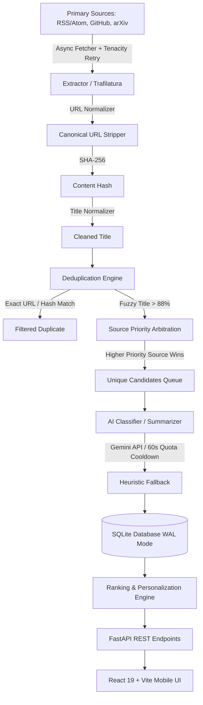
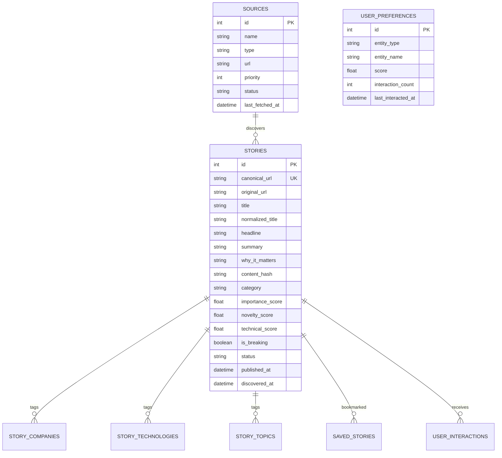

# AI RADAR — Architecture & System Design Document

## 1. System Philosophy

The core architectural tenet of **AI RADAR** is:
> **Collect first from authoritative primary origins; classify, score, and summarize downstream.**

An LLM is never tasked with answering "what's the latest AI news?" Instead, the ingestion engine collects verbatim content from primary source feeds (official developer blogs, research preprint servers, GitHub release streams). The LLM is strictly used as an analytical extraction engine to classify topics, score novelty and technical depth, produce grounded 15-word headlines, 1–3 sentence summaries, and a single "Why it matters" statement.

---

## 2. Ingestion & Normalization Pipeline



### 2.1 Normalization Engine
- **Canonical URL Normalization**:
  - Drops marketing queries (`utm_*`, `fbclid`, `gclid`, `ref_`, `affiliate`).
  - Standardizes trailing slashes, downcases hostnames, removes default ports (`:80`, `:443`), and strips anchor fragments (`#...`).
  - Query parameters are deterministically sorted to prevent duplicate permutations.
- **Title Normalization**:
  - Strips source branding suffixes (e.g., `| OpenAI`, `- Google DeepMind`, `:: Hugging Face`).
  - Converts smart quotes and unescapes HTML entities.
- **Content Hashing**:
  - Normalized plaintext SHA-256 signature detects cross-syndicated articles with differing URLs.

### 2.2 Deduplication Engine
- Matches canonical URL against database records.
- Matches content hash against existing stories.
- Employs **RapidFuzz** `token_sort_ratio` (> 88.0 threshold) for title fuzzy matching.
- **Source Priority Arbitration**: When two sources report the exact same breakthrough, the primary source with the highest priority tier (e.g., Tier 1 Google DeepMind vs. Tier 3 secondary re-publisher) is preserved.

---

## 3. Classification & Grounded Summarization

### 3.1 Structured AI Schema
The classifier uses the official Google GenAI SDK (`gemini-3.8-flash`) enforcing strict JSON schema output:
```json
{
  "is_ai_related": true,
  "category": "AI Models",
  "sub_category": "Large Language Models",
  "companies": ["OpenAI"],
  "technologies": ["Transformers", "RLHF"],
  "topics": ["Reasoning", "Pretraining"],
  "importance_score": 85.0,
  "novelty_score": 80.0,
  "technical_score": 75.0,
  "is_breaking": false,
  "headline": "Concise headline under 15 words",
  "summary": "1-3 concise grounded sentences strictly reflecting source text.",
  "why_it_matters": "Exactly one sentence explaining operational relevance.",
  "is_downranked": false
}
```

### 3.2 Resilience & Free-Tier Quota Cooldown
- If Gemini API returns HTTP 429 (`RESOURCE_EXHAUSTED`), the classifier sets an internal 60-second cooldown and routes seamlessly to `HeuristicClassifier`.
- `HeuristicClassifier` uses regex pattern matching for 10+ AI categories, companies, and technologies, preventing hangs or scan failures.
- Non-blocking execution: Remote synchronous client calls are dispatched onto worker threads via `asyncio.to_thread`.

---

## 4. Ranking & Personalization Mathematics

### 4.1 Transparent Composite Scoring
The feed score for any story is computed as:
$$\text{Score} = 0.40 \cdot \text{Importance} + 0.30 \cdot \text{PersonalRelevance} + 0.20 \cdot \text{Recency} + 0.10 \cdot \text{Novelty}$$

### 4.2 Recency Decay
Recency decays exponentially with a 48-hour half-life:
$$\text{Recency}(t) = 100 \cdot e^{-\lambda \cdot \Delta t}$$
where:
$$\lambda = \frac{\ln(2)}{48} \approx 0.01444$$
A story published 48 hours ago has a recency score of 50.0; after 96 hours, 25.0.

### 4.3 Learned Personalization Affinities
User interactions apply incremental deltas to category, topic, company, and technology affinity weights:
- **Swipe Right (Like)**: $+3.0$
- **Save / Bookmark**: $+6.0$
- **Open Source Link**: $+2.0$
- **Swipe Left (Pass)**: $-1.0$ (gentle decay)

Weights are clamped within $[-15.0, +60.0]$ to prevent filter bubbles while ensuring high-relevance discoveries float to the top of the **For You** feed.

---

## 5. Database Schema (SQLite WAL Mode)


